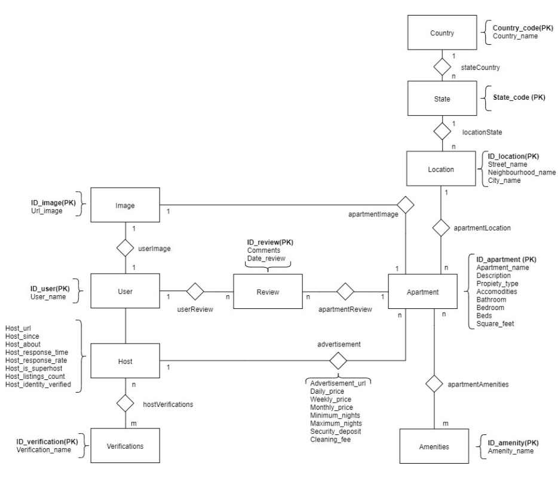
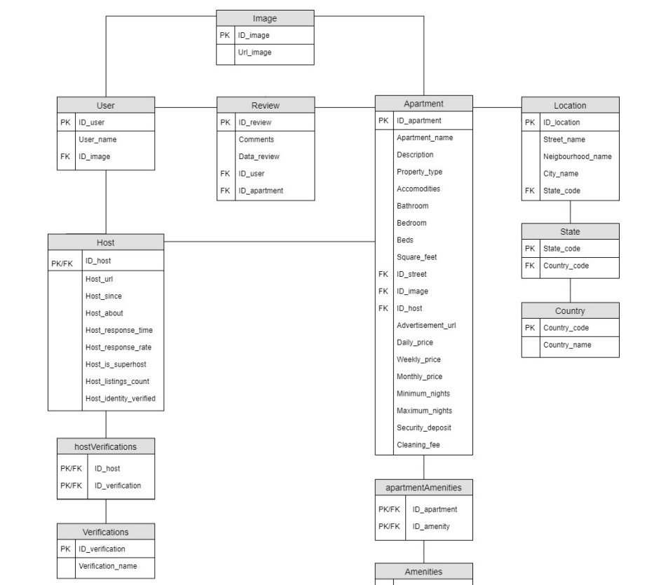

# AirBnb-Dataset-Import
Get AirBnb dataset in CSV and import it in a database using mySQL

## Dataset 
The dataset used to import the data is separated in 3 .cvs (Review.csv, Hosts.csv, Apartments.csv) If you want to acces to it, here is a download link https://mega.nz/folder/yg1mwIqJ#dmX0xIr6r_rH0-7sTnREIg
- Review: Reviews made by the hosts and users of the app
- Hosts: The users who rent the apartments
- Apartments: All the apartments listed in the app 

## Conceptual Model

Once the dataset is analysed we need to separate and organize the data in a coceptual model so then we can use it as a base for the Relational Model

## Relational Model

Once the dataset is analysed we need to separate and organize the data in a coceptual model so then we can use it as a base for the Relational Model
